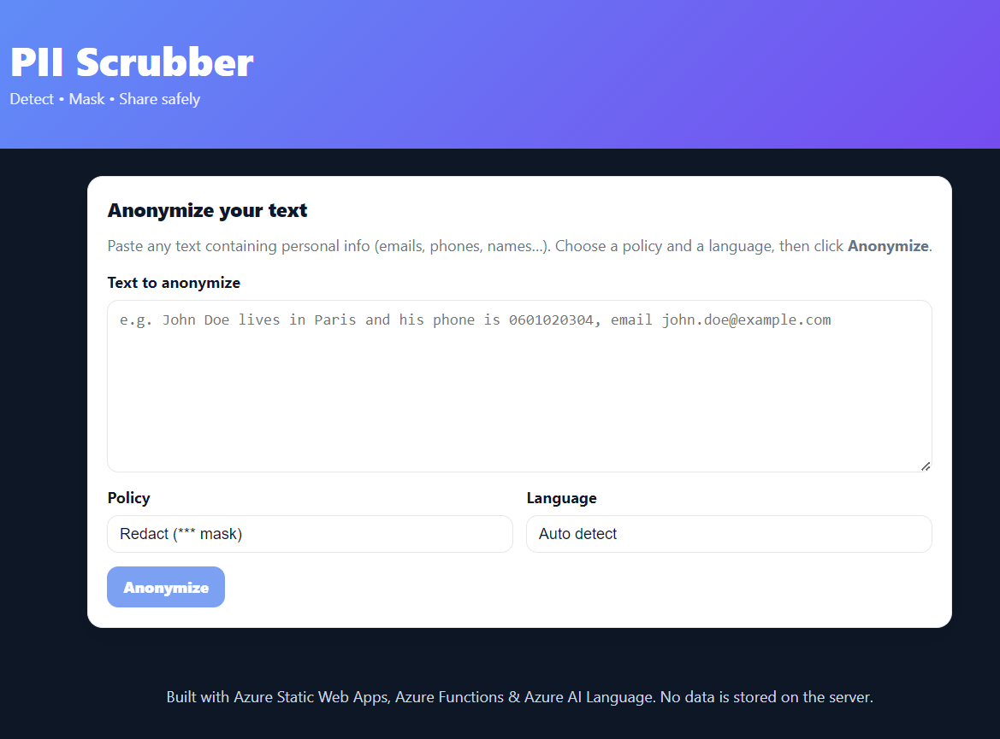

# PII Scrubber

A simple web app that detects and anonymizes Personally Identifiable Information (PII) from text. It helps organizations stay compliant (e.g., GDPR) and helps individuals anonymize documents before sharing.

This project was mostly coded using GitHub Copilot to evaluate its coding performance.



## Overview (Non‑technical)
Paste text into the website, click “Anonymize,” and get a cleaned version with sensitive parts hidden or replaced. You can download the anonymized text as a .txt file. The app runs in your browser and uses Microsoft Azure’s AI service to find PII.

## For Developers
PII Scrubber is a Static Web App frontend with an Azure Functions backend. The backend calls Azure AI Language (PII detection API) to identify entities and returns an anonymized string plus span positions for highlight rendering. The app currently uses the default Azure AI Language PII model; adding custom training later can improve accuracy and enable industry‑specific detection.

## Features
- PII detection using Azure AI Language (PII API)
- Anonymization policies: redact, pseudo, hash
- Before/after view with highlighted replacements
- Language setting: auto, en, fr
- Download anonymized output (.txt)
- Automatically deployed with GitHub Actions on every push

## Use Cases
- Companies: compliance workflows, GDPR/CCPA support, internal data protection, redacting logs/tickets.
- Individuals: anonymize resumes, letters, and personal documents before sharing.

## How It Works
1. User enters text in the frontend.
2. Frontend POSTs to the Azure Function: `/api/sanitize` with `{ text, language, policy }`.
3. Function calls Azure AI Language PII detection with your `LANGUAGE_ENDPOINT` and `LANGUAGE_KEY`.
4. Function returns anonymized text and PII spans.
5. Frontend displays side‑by‑side original/anonymized with highlights and offers a download.

## Project Structure
- app/ — Static Web App frontend (React)
  - src/
    - App.jsx — main UI and fetch logic
    - App.css — styles
- api/ — Azure Functions backend
  - sanitize/ — HTTP-triggered function calling Azure AI Language PII API
  - local.settings.json — local dev settings (not committed)
- docs/
  - screenshot.png — UI screenshot used in this README
- .github/workflows/ — GitHub Actions workflow for SWA deploy
- Readme.md — this file

Note: Exact filenames may vary; the core layout follows SWA + Functions conventions.

## API
- Endpoint: `POST /api/sanitize`
- Request body:
```json
{ "text": "string", "language": "auto|en|fr", "policy": "redact|pseudo|hash" }
```
- Response (example):
```json
{
  "anonymized": "Hello, my name is [REDACTED].",
  "spans": [{ "start": 18, "end": 28, "type": "Person" }]
}
```

## Setup Instructions

### Prerequisites
- Node.js LTS and npm
- Azure subscription
- Azure AI Language resource (Cognitive Services) with keys
- Azure Functions Core Tools (for local API)
- Azure Static Web Apps CLI (optional for local end‑to‑end)

### Environment Variables
Set the following for the Azure Function:
- LANGUAGE_ENDPOINT — your Azure AI Language endpoint URL
- LANGUAGE_KEY — your Azure AI Language key

For local development, add to `api/local.settings.json`:
```json
{
  "IsEncrypted": false,
  "Values": {
    "AzureWebJobsStorage": "UseDevelopmentStorage=true",
    "FUNCTIONS_WORKER_RUNTIME": "node",
    "LANGUAGE_ENDPOINT": "https://<your-language-resource>.cognitiveservices.azure.com/",
    "LANGUAGE_KEY": "<your-key>"
  }
}
```

### Run Locally
- Frontend:
  - In `app/`: `npm install` then `npm start`
- Backend:
  - In `api/`: `npm install` then `func start`
- Configure the frontend to call `/api/sanitize` (relative path). When using SWA CLI:
  - From project root: `swa start app --api-location api`

### Deploy to Azure Static Web Apps
- Create a Static Web App in Azure Portal and connect your GitHub repo.
- The portal sets up a GitHub Actions workflow that builds and deploys on every push.
- Ensure `LANGUAGE_ENDPOINT` and `LANGUAGE_KEY` are configured as application settings for the Functions environment.

## Future Improvements
- Custom classification/NER models for domain‑specific PII
- Enhanced UI and accessibility
- Improved anonymization policies and audit logs
- Broader multi‑language support and locale‑aware rules

## License
Add your license of choice